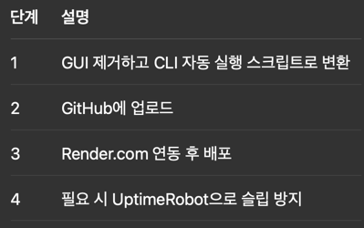

## 🛠 전체 작업 흐름
1.	GUI 코드에서 GUI 요소 제거 (CLI 또는 백그라운드 작업으로 리팩터링)
2. Render.com 계정 생성 및 GitHub 연동
3.	코드를 GitHub에 업로드
4.	Render.com에서 Web Service 생성
5.	(옵션) 외부에서 유지하려면 UptimeRobot으로 주기적 호출 설정
***
## 🔧 1단계: GUI 제거 및 CLI 스크립트로 변환

GUI를 사용하지 않고 자동으로 작동하도록 아래처럼 수정해야 합니다.

예: main.py 리팩터링
```Python
# 기존: import wx 사용 → 제거
import time
from crawler import get_news_links
from gpt import summarize
from kakao import send_to_kakao

def main():
    print("뉴스 크롤링 중...")
    articles = get_news_links()
    best_article = summarize(articles)
    send_to_kakao(best_article)
    print("카카오톡 공유 완료!")

if __name__ == "__main__":
    while True:
        main()
        time.sleep(3600)  # 1시간마다 실행
```
***
## 📂 2단계: 프로젝트 구조 (예시)
```
my_project/
├── main.py
├── crawler.py
├── gpt.py
├── kakao.py
├── requirements.txt
├── README.md
```
requirements.txt에는 사용하는 패키지 명시:
```
requests
openai
bs4
```
***
## 🧑‍💻 3단계: GitHub에 코드 업로드
1. GitHub 계정 생성
2. 로컬에서 아래 명령으로 업로드
```bash
git init
git remote add origin https://github.com/yourname/news-bot.git
git add .
git commit -m "init"
git push -u origin master
```
***
☁️ 4단계: Render.com 설정
1. https://render.com 가입
2. Dashboard → New > Web Service 
3. GitHub 연동 → 위 프로젝트 선택 
4. Build Command:
```pip install -r requirements.txt```
5. Start Command:
```python main.py```
6. Free Tier 선택 
   - Render는 웹서버 목적이지만, 콘솔 출력만 있는 스크립트도 web service 형태로 실행 가능
***
## 🔁 5단계: 자동 실행 유지 (옵션)

- Render는 15분간 요청 없으면 슬립 상태로 전환됨.
- 이를 방지하려면:
  - ps://uptimerobot.com 가입 
  - Render 서비스의 URL을 대상으로 5분마다 HTTP 요청 설정
***
## ✅ 정리
